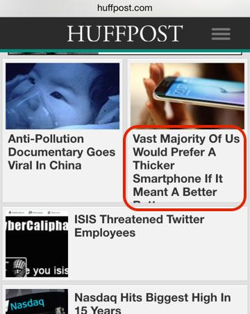

# Drupal Design Guide
This is a living document developed by [Isovera](https://www.isovera.com/) to help design agencies work better with developers in creating responsive websites with Drupal. 

The guide documents the best practices and pitfalls that we’ve experienced when collaborating with external design agencies on responsive websites. This guide is a work in progress and we are constantly refining our development process. Please [contact us](https://www.isovera.com/contact-us) Feel free to review, absorb, and share.

## Preface

Front-end web development has entered an exciting and volatile phase. Responsive web design has moved from a novelty to a client expectation. Meanwhile, the agile development methodology has moved from its roots in product development and software applications to web design agencies. Along with this change, came new technologies and more efficient and adaptive workflows.

## Content-Driven Design

Design prototypes need placeholder text and graphics. In this section, we recommend spending the additional time to engage the client to obtain real client content for the production website. This makes us more dependent on a busy, or possibly, unmotivated client, but it is critical to the implementation and long-term success of the project.

### Use real, representative content

It’s tempting to use Bacon ipsum for placeholder text, and in certain circumstances, there’s nothing wrong with "ham hock bresaola". But the client content is the single most important thing about the site. All too often designers bake assumptions into the design as simple as the length, or even presence, of a line of text.

Whether the final copy already exists or not, you will need real content to flesh out the real-world display of content displays and user interfaces.

#### Content varies

Paragraph and line length are variable but have patterns. Identify the edge cases and include those in your decision making process. Using several pieces of real content (rather than a single, repeated item) can help expose a design’s unrealistically rigid assumptions about character length.

In the following screenshot from the front page of the Huffington Post,  "Battery" is unintentionally hidden.

The space allotted for the title mirrors the space for the image, which preserves the alignment between the two rows. Unfortunately, this hard-coded design decision hides the end of the headline.

Try to think in terms of structured content and variable, fluid heights. Sometimes, selectively display different fields depending on viewport size, e.g. long title versus short title.

[Truncation is not a content strategy](https://twitter.com/karenmcgrane/status/520576694210801665).

Get the aspect ratios and image sizes of the client’s available and potential image library.

Interactions between bitmap images and overlapping text can be especially delicate. Text should almost never be rendered within an image, but overlaid as a separate element. Expect the font to be resized by the user.

[Example: text overlaid on an image at various screen sizes. Change font size?]

#### Identify the client’s capabilities

Client’s have a limited amount of time and resources. Do they have a dedicated content creator? Will they have time allocated to work on the content of that special feature? Do they have access to Photoshop and are they comfortable working with HTML? Don’t assume they will use the tools that  you have access to as a designer. Limit content to what the client can provide and maintain.

### Resilient, not brittle

People don’t read, they scan the web. Design for sub-optimal attention spans. The site visitor could be cognitively impaired, distracted or in a crisis.

## Universal Design

### Accessibility is for everyone

Curb cuts are good for baby strollers, lever door handles are useful when your hands are full or there’s an emergency. Seemingly innocuous design decisions can make a site impossible to use for some people. Read up on [WCAG 2.0](http://www.w3.org/TR/WCAG20/). Accessibility is also a human right.

## Mobile-First Design

### Start small

Don’t start with the best case scenario. Design for small devices first to prioritize content and user actions. Design for low bandwidth, small screens and enhance.

Designing for small, mobile devices also streamlines the development of the HTML source code order. Once the HTML source order is established, the site is amenable to mobile device support and accessibility. Large screen size layouts can be built on top of this base. It can be more difficult and time-consuming to extract the source order from a large screen size layout.

Don’t assume optimal bandwidth.

Art direction for responsive design: landscape/portrait, small/large:

[http://usecases.responsiveimages.org/#art-direction](http://usecases.responsiveimages.org/#art-direction)

Performance is critical. Consider image file sizes and count. Too many widgets or too large images will degrade the page load.

### On Design Artifacts

Models, scaffolding and stencils.

[Responsive deliverables](http://daverupert.com/2013/04/responsive-deliverables/)

Ultimately, the working website is the only deliverable.

### Formats

If you’re working with photoshop, provide the original PSD files with layers, not static image exports. Don’t waste precious developer time decomposing and reverse engineering basic things like relative font sizes and color values. Make sure that font family, sizes and weights are identified or identifiable

Always provide high resolution images and vector art when available.

Use progressive JPEGs or interlaced PNG file formats. Users perceive them as faster and they preserve responsive layouts while the image is loaded.

[example of loading responsive layout]

#### Web fonts

Users can and will change the default font size.

Reference other sites that implement similar techniques.

Complex features like dynamic forms, calendars or search results filtering may require close coordination with the developer. Collaborating with working, browser-testable prototypes is best.

Time-sensitive features especially can expose unexpected design challenges: expiration, time zones, daylight savings time, archiving, etc.

## Fluid Design

### Pixel perfect is dead

Think relative units and not absolute pixels. Unfortunately, tools like Photoshop base their conceptual model on fixed widths. This becomes an unwieldy liability as mockups multiply exponentially for a range of pages and viewport sizes.

Use percentages or root em (rem) units instead of pixels. Root em units scale in proportion to the base font size. Pixel-based designs are fixed and brittle. Relative units scale appropriately for the device size and browser settings.

### Use a fluid grid

Typography has an established history of grid-based layouts. In the mid-2000’s, the 960 pixel grid system became a popular tool for website layouts. Instead of designing in terms of pixels, the designer could evenly subdivide the interior 960 pixels of the screen into a number of columns.

For example, each column in an 8 column layout is 120 pixels wide. Then, instead of using pixels, a sidebar can be described as occupying the first 2 columns of the grid and the main content area the last 6.

This was a tidy solution until the explosion of the mobile devices and retina screens. The 960 pixel grid system quickly showed its limitations. Ethan Marcotte subsequently [popularized fluid grid systems](http://alistapart.com/article/fluidgrids), which base their widths on percentages instead of pixels. Fluid grids, along with flexible images and CSS media queries are the basis for [responsive web design](http://www.abookapart.com/products/responsive-web-design).

##### Acknowledge remainders in grids

For some components, the total count of items in a grid will not conform to a predetermined grid count. The items in the bottom row often will not complete the allotted column spaces. For example, a search result may return five items in four-column grid. In this case, there is no reason to expect a rounded result set. Moreover, this scenario is exacerbated when using responsive grids. When a three-column grid switches to two-columns, unless the total count is divisible by six, there will be a straggler. These gaps are not inherently a problem, but they open up seams in the design that are typically disregarded in static comps. Instead of creating the illusion of perfect content with no gaps, they should be presented. With this shared knowledge, they can even be used opportunistically to present supplementary information or decoration.

### Breakpoints

The web is fluid. Web browsers are a continuum of shapes, sizes, resolutions and capabilities. Instead of focusing exclusively on one, two or three breakpoints, consider appearance at interstitial viewport sizes. Remember that users often don’t maximize their browser windows.

A note on frameworks, e.g. Bootstrap, Foundation, etc.

## Style Guide-Driven Design

### Style guides

Tailor the elements.

* Content headers, lists, blockquotes
* Form fields, fieldsets and buttons
* Links

Components

* Common
    * Pagers
    * Tabs
    * AJAX throbbers
    * Fallback default images

* Custom
    * Auction teaser
    * Ancillary block

Last but not least, standard system pages.

* Search results
* ‘Page not Found’ and ‘Access Denied’ pages
* System messages
* Maintenance page

Pay special attention to links.  Represent links consistently so the user can predict what is a link and what is not.  Prefer usability to perfect aesthetics.

* Basic text anchor tags
* Images
* Teasers and other composite wrapping links

Don’t forget user interactions

* Mouse hover
* Tap/click
* Scroll

Consider animation

[Adding items](http://codepen.io/valhead/full/adnKt)

[jQuery Approach](http://srobbin.com/jquery-plugins/approach/)

## Agile Workflows

### Mockups

* Low fidelity is good
* High fidelity is expensive

### Iterate

How does a design work? What is the user experience? There is a growing need to flesh out implicit assumptions about how a user interface will work in the real world.

Explore breakpoints.

Sketch, screen share and explain your ideas and assumptions. Or meet in person.

As [Ben Callan of Sparkbox has emphasized](http://www.uie.com/brainsparks/2014/11/07/ben-callahan-dissecting-design-live/), humility and empathy are key virtues for a successful responsive web design team. No one person on the project will be able to dictate the operational design of the site.

## Glossary

*Component* - A repeatable pattern composed of text, form fields, images, or other elements. We use this term in place of *module*, which can be confused with the Drupal programming term.

## Further reading

### Online

* [Build for Four Corners, No Matter the Size](http://zurb.com/responsive/design) Zurb University
* [This is Responsive](http://bradfrost.github.io/this-is-responsive/) by Brad Frost
* [Website Style Guide Resources](http://styleguides.io) by Anna Debenham and Brad Frost
* [Responsive Web Design podcast](http://responsivewebdesign.com/podcast/) featuring Ethan Marcotte and Karen McGrane

### Books

* [Responsive Web Design](http://abookapart.com/products/responsive-web-design) by Ethan Marcotte
* [The Responsive Web](http://www.manning.com/carver/) by Matthew Carver
* [Mobile First](http://abookapart.com/products/mobile-first) by Luke Wroblewski
